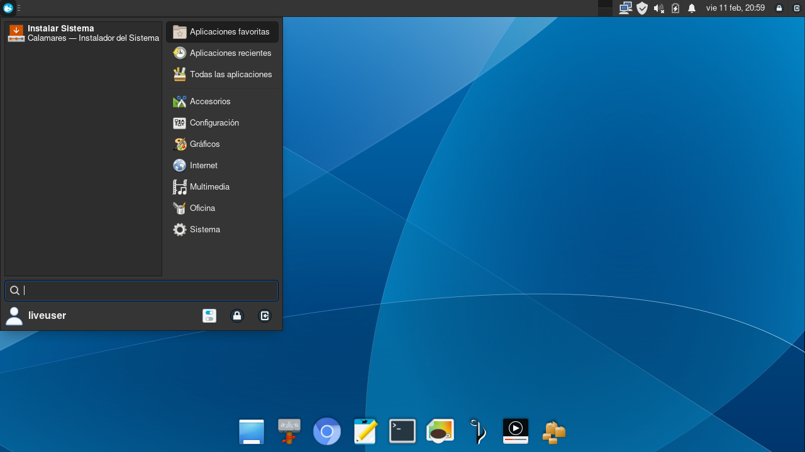
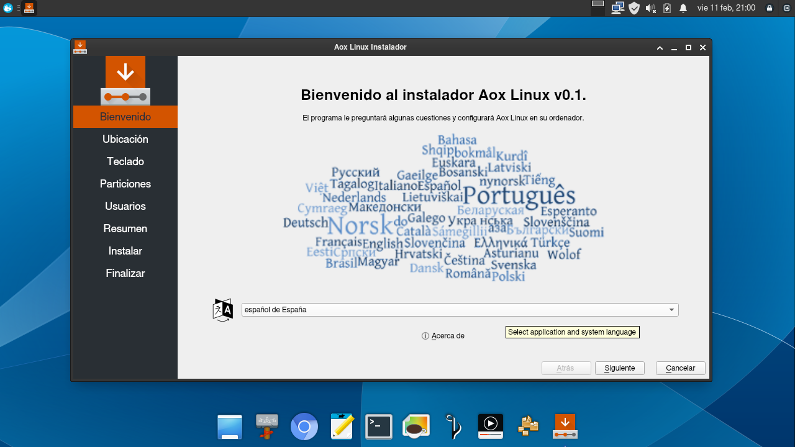
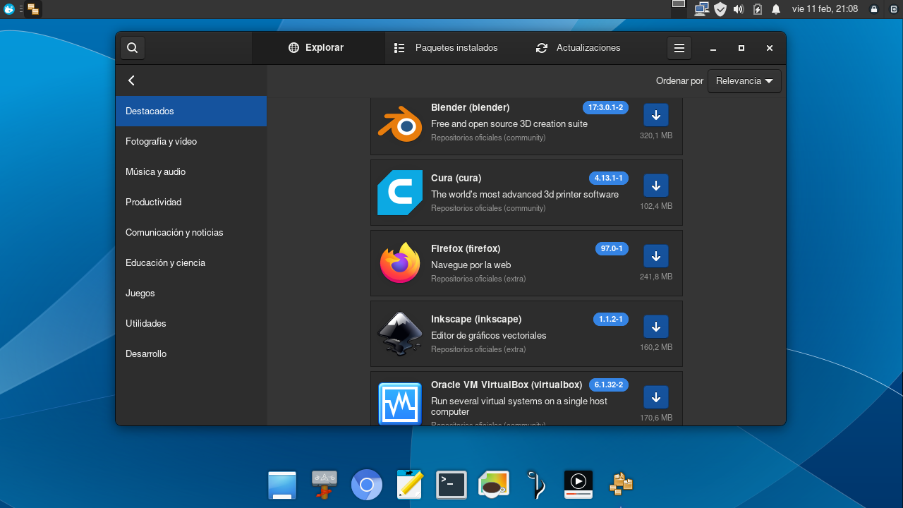
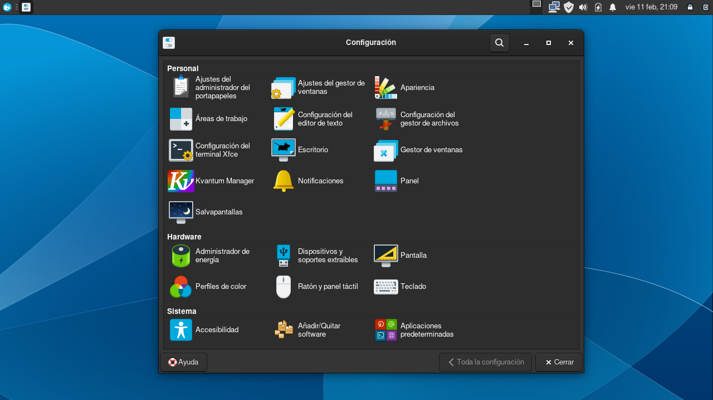
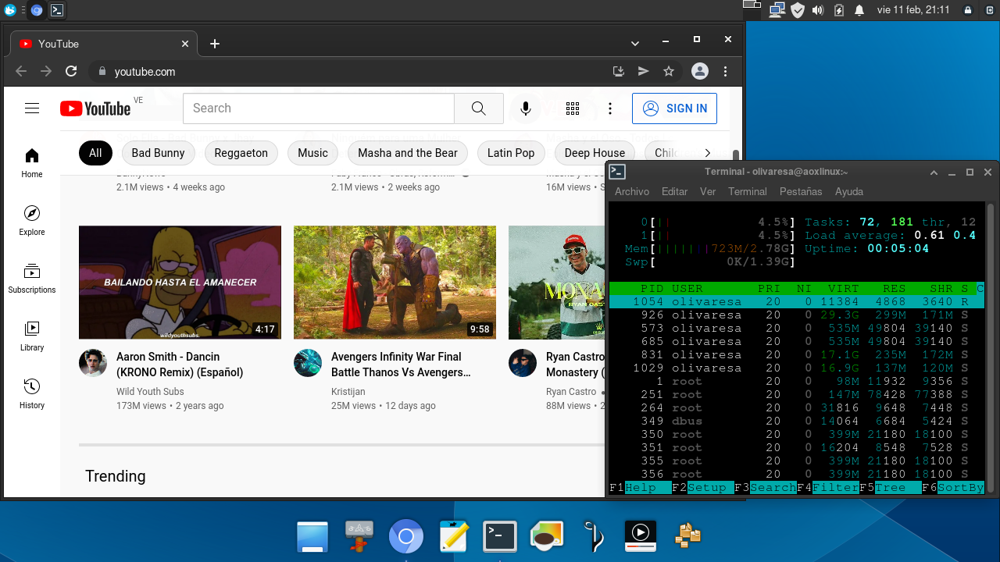

Aox es una distribución Linux derivada de [Arch](https://archlinux.org/) para computadoras [x86_64](https://es.wikipedia.org/wiki/X86-64), su principal objetivo es brindar un escritorio de trabajo limpio con aplicaciones necesarias para un usuario común.

    

### Características:
    - Instalador gráfico - Live CD/USB ISO.
    - Entorno de escritorio sencillo y configurable.
    - Repositorio de aplicaciones para instalar de forma fácil utilizando entorno gráfico.
    - Velocidad en el arranque y ejecución de las aplicaciones, ideal para computadoras con bajos recursos de Hardware.

### Requerimientos:
    - PROCESADOR: 1.2 GHz.
    - MEMORIA: 1GB ram.
    - DISCO: 8gb de espacio.
    - MONITOR: Pantalla VGA con resolución  1024x768.
    - MEDIO: Unidad DVD o USB Pendrive para la imagen ISO.

### Descargar:
&ensp; **[.iso Live CD/USB](https://github.com/olivaresa/aoxlinux/releases/download/v0.1-beta/aoxlinux-2022.02.13_v0_1-x86_64.iso)**
> - **_usuario:_** liveuser
> - **_contraseña:_** liveuser

### Capturas de pantalla

